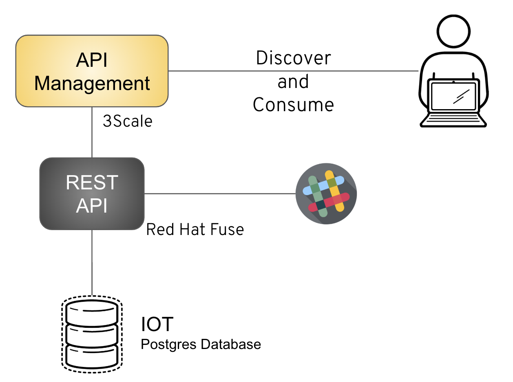

= IOT API First approach

== Prepare the environment in Openshift

	oc new-project iot
	oc new-app --template=postgresql-persistent --param=POSTGRESQL_PASSWORD=redhat --param=POSTGRESQL_USER=redhat --param=POSTGRESQL_DATABASE=sampledb

 Create and populate database

    # Stablish a SSH connection into postgres container
	psql -U redhat -d sampledb	
  
	CREATE TABLE devices(
	 id serial PRIMARY KEY,
	 name VARCHAR (50),
	 model VARCHAR (50)
	);
  
	INSERT INTO devices(name, model) VALUES  ('Linksys XM23', 'Router');
	INSERT INTO devices(name, model) VALUES  ('Iphone', 'Mobile');
	INSERT INTO devices(name, model) VALUES  ('Android', 'Mobile');
	INSERT INTO devices(name, model) VALUES  ('Nighthawk', 'Router');
	INSERT INTO devices(name, model) VALUES  ('Linksys XM23', 'Router');

== Configure in Red Hat Fuse Online

Configure a database connector in Fuse Online

	url: jdbc:postgresql://postgresql.iot:5432/sampledb
	user: redhat
	password: redhat
	
During the API definition, use this schema in datatype:

	{
	    "id": 0,
	    "name": "Iphone X",
	    "model": "Mobile"
	}

During the flow implementation, use this queries:

Get All

  SELECT * FROM DEVICES

CREATE DEVICE

  INSERT INTO DEVICE(NAME,MODEL) VALUES(:#NAME,:#MODEL);

FIND DEVICE

  SELECT * FROM DEVICES WHERE ID=:#ID

Optionally you can map these find service to output the result in Slack Chat 

	You need to simple configure Slack as a component providing the correct credentials and put as additional step into Fuse Online. 

== 3Scale Configuration

Create two backends, point the backends to the service deployed into Fuse Online. 

. devices 

With the following mapping rules

* create-device
* find-device
* update-device

. sms-api (it will not be used into the demo so, just poin to echo api)

* get sms detail 
* search sms
* send sms

Create application plans 

. sandbox

* Rate limit two 10 calls for minute 

. production

* None rate limit and pricing rule for 1 dolar for each 10 calls 
